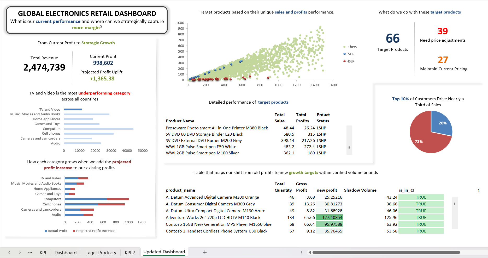

# Regional Pricing Impact Analysis

Analyzing regional pricing to support profit-driven adjustments across countries without compromising customer trust, using SQL, Python and Excel.


## Table of Contents
---
- <a href="#overview">Overview</a>
- <a href="#business-problem">Business Problem</a>
- <a href="#data-source--credits">Data Source & Credits</a>
- <a href="#tools--technologies">Tools & Technologies</a>
- <a href="#project-structure">Project Structure</a>
- <a href="#data-cleaning--preperation">Data Cleaning & Preperation</a>
- <a href="#exploratory-data-analysis-eda">Exploratory Data Analysis (EDA)</a>
- <a href="#research-questions--key-findings">Research Questions & Key Findings</a>
- <a href="#dashboard">Dashboard</a>
- <a href="#how-to-run-this-project">How to run This Project</a>
- <a href="#final-recommendations">Final Recommendations</a>
- <a href="#author--contact">Author & Contact</a>

---

<h2><a class ="anchor" id="overview"></a>Overview</h2>

This project analyzes retail pricing across different countries to find where prices are misaligned according to its demand. It uses SQL, Python, and Excel to clean data, test product performance, and visualize profit margins. The goal is to suggest pricing changes that improve profits without losing customer trust.

---

<h2><a class ="anchor" id="business-problem"></a>Business Problem</h2>

Retail profit margins were uneven across different countries and store locations, making it hard to understand where pricing was working well and where it wasn’t. Some products were selling a lot but earning very little, while others had high prices but low sales. The business needed a clear way to spot these issues and adjust prices without upsetting loyal customers. This project helps identify those gaps using data.

---

<h2><a class="anchor" id="data-source--credits"></a>Data Source & Credits</h2>

- This project is based on a dataset provided by [Maven Analytics](https://mavenanalytics.io/data-playground/global-electronics-retailer).  
    - All rights and original content belong to Maven Analytics.  
    - Used here for educational and portfolio purposes.
- Multiple csv files located in '/data/' folder (sales, customers, products)
- Summary Table created from ingested data and used for analysis

---

<h2><a class="anchor" id="tools--technologies"></a>Tools & Technologies</h2>

- SQL (Common Table Expressions, Joins, Filtering)
- Python (Pandas, Matplotlib, Seaborn, SciPy)
- Excel (Dashboard)
- GitHub

---

<h2><a class="anchor" id="project-structure"></a>Project Structure</h2>

```

regional-pricing-impact-analysis
├── README.md
├── .gitignore
├── regional_pricing_impact_report.pdf
│
├──images/                      # Images
    ├──dashboard.png
├── notebooks/                  # Jupyter notebooks
│   ├── exploratory_data_analysis.ipynb
│   ├── regional_pricing_analysis.ipynb
│   └── back_testing.ipynb
│
├── scripts/                    # Python scripts for ingestion and processing
│   ├── Ingestion_db.py
│   └── get_sales_summary.py
│
├── dashboard/                  # MS Excel dashboard file
│   └── regional_pricing_impact_dashboard.xlsx
```
---

<h2><a class="anchor" id="data-cleaning--preperation"></a>Data Cleaning and Preperation</h2>

- Creted summary table with required region,sales and customer metrics
- Added new columns useful for further analysis(Total Sales,Gross Profit, etc)

---

<h2><a class="anchor" id="exploratory-data-analysis-eda"></a>Exploratory Data Analysis (EDA)</h2>

**Summary Statistics Insights:**
- Total Quantity: Total quantity count is more for 1, 2 and 3 quantities, which tells us most of the customers are interested in placing single quantity orders, less bulk orders
- Total cost and Total sales : The max values(144.3,187.2) which are higher than the mean(23.51,39.42) this may be due to bulk ordering of some products and this is also reason for max Gross_Profit in some orders

**Correlation Insights:**
-	Unit_Cost_USD has strong negative correlation with Gross_Margin(-0.85) and Gross_Profit(-0.34) suggests costprice per unit increses, Gross_Profit and Gross_Margin decreses, possibly due to more discoutns on the product
-	Gross_Profit has strong positive correlation with Total_Quantity, confirming bulk orders reults high profits
-	Unit_Price_USD has positve correlation with Gross_Margin(0.52), suggests Unit_Price_USD increses, Gross_Margin increses, if we change prices in an optimal way results in increse in Gross_Margin

---

<h2><a class="anchor" id="research-questions--key-findings"></a>Research Questions & Key Findings</h2>

1. **Product categories which show the highest price sensitivity across regions:** 3 categories 'TV and Video', 'cameras and camcoders','home appliances'across all countries
2. **Top performing products in sales but low profits:**
 **39** unique products that perfrom good in US(59.77%), UK(11.77%) and Germany(8.29%) and bad in other countries
 3. **Top performing customers:** Top **10%** customers contributing **28.23%** of the total revenue
4. **Products with low sales and high profits:** **27** unique products that performed low in multiple countries
5. **Hypothesis Testing:**
The Gross Profits of top performing and low performing states are significantly different 

---

<h2><a class="anchor" id="dashboard"></a>Dashboard</h2>

- Excel Dashboard shows:
    - Top and Low Performing States
    - Top Contributing customers
    - Countires for product price adjustments
    - Price sensitve categories categories accross different countries


    

    ---

<h2><a class="anchor" id="how-to-run-this-project"></a>How to Run This Project</h2>

1. Clone the repository:
```bash
git clone https://github.com/yourusername/regional-pricing-impact-analysis-sql-python-excel.git

```
2. Load the CSVs and ingest into database:

```bash
python scripts/ingestion_db.py
```
3. Create sales summary table:

```bash
python scripts/get_sales_summary.py

```
4. Open and run notebooks:

```bash
    -notebooks/exploratory_data_analysis.ipynb
    -notebooks/regional_pricing_analysis.ipynb
    -notebooks/back_testing.ipynb
```

5. Open Excel Dashboard:

```bash
dashboard/regional_pricing_impact_dashboard.xlsx

```
---

<h2><a class="anchor" id="final-recommendations"></a>Final Recommendations</h2>

- Raise prices on high-selling and low-profit products in top-performing states of US, UK, Germany, and Canada to boost margins without affecting sales.

- Lower prices on low-selling and high-profit products in underperforming countries like Netherlands, Italy, France, and Australia.

- Increase prices for strong categories: computers, cell phones, music, movies, and audiobooks across all regions

- Expand top performing categories with new products, particularly computers would generate good revenue.

- Reduce prices in price-sensitive categories in low-performing countries; keep prices stable in top-performing countries like US,UK and Germany

- Expand store presence in the Netherlands, Italy, France, and Australia.Launch targeted marketing and discount campaigns in these countries to drive more sales

- Offer premium services and enhanced security to top-contributing customers.

- Introduce seasonal offers to attract new customers and boost engagement.


---
<h2> Price Adjustment Strategy</h2>

To validate my strategy, I conducted a Shadow Price Back-test on identified **66** products to ensure our price changes are safe and profitable. I simulated a 5% price adjustment and used Elasticity to predict how much the sales volume would naturally drop. I then checked if this new volume stayed within the Confidence Interval (2 Standard Deviations) of historical store performance. This confirms that our plan is realistic and won't cause an extreme sales crash.

Through back-testing and elasticity modeling, this analysis identified a dual-path pricing strategy.

Out of 39 products only 1 product is not between Confidence Interval(Outlier) and other 38 products are safe for price adjustments. For 38 high-volume products, a 5% price optimization was validated, and for 1 outlier product used old profit(Gross Profit), yielding a projected profit increase of $1365.

For 27 high-margin products, back-testing across multiple price-drop scenarios (1%-5%) confirmed that these items are price-insensitive. Consequently, the recommendation is to hold current pricing to protect margins, as volume stimulation via price-cuts is not mathematically viable.

Total Project Impact: **$1365** in immediate bottom-line growth and prevention of margin erosion on low sales high profit products.

---

<h2><a class="anchor" id="author--contact"></a>Author & Contact</h2>

**Gundeti Sailikith**

Aspiring Data Analyst

📧 Email: gundetisalikith@gmail.com

🔗 [LinkedIn](https://www.linkedin.com/in/sailikith-gundeti-807179280?utm_source=share&utm_campaign=share_via&utm_content=profile&utm_medium=android_app)
